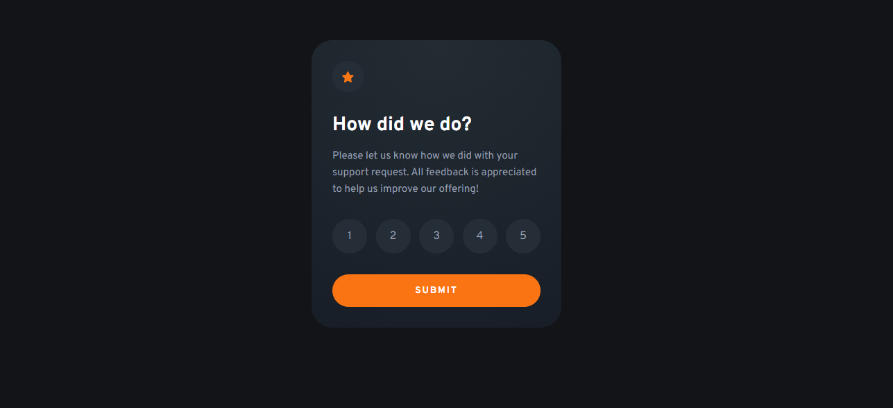
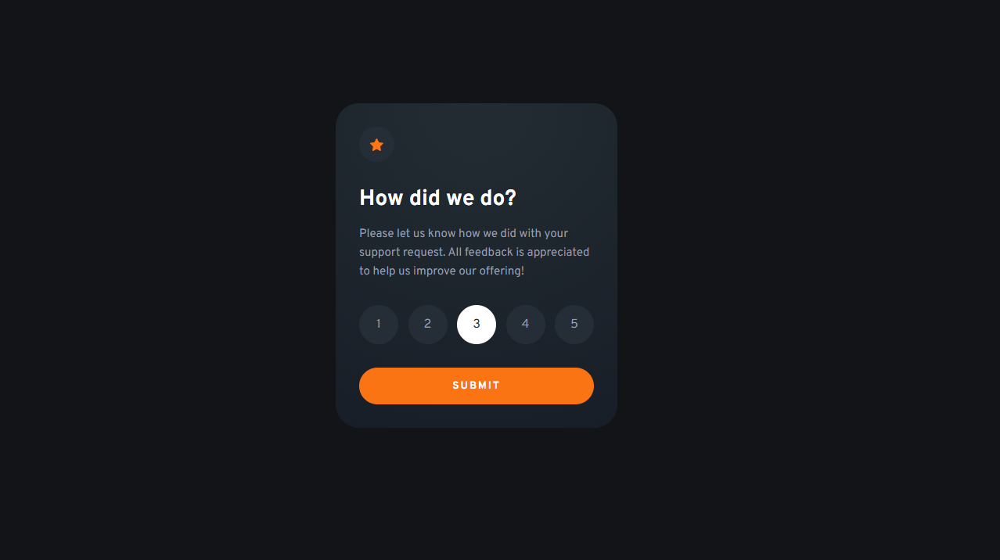
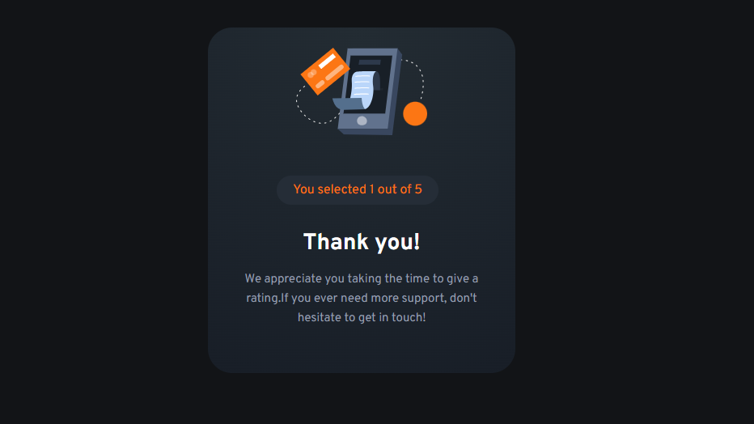

# Frontend Mentor - Interactive rating component solution

This is a solution to the [Interactive rating component challenge on Frontend Mentor](https://www.frontendmentor.io/challenges/interactive-rating-component-koxpeBUmI). Frontend Mentor challenges help you improve your coding skills by building realistic projects. 

## Table of contents

  - [The challenge](#the-challenge)
  - [Screenshot](#screenshot)
  - [Links](#links)
- [My process](#my-process)
  - [Built with](#built-with)
  - [What I learned](#what-i-learned)
  - [Continued development](#continued-development)
  - [Useful resources](#useful-resources)
  - [AI Collaboration](#ai-collaboration)
- [Author](#author)

### The challenge

Users should be able to:

- View the optimal layout for the app depending on their device's screen size
- See hover states for all interactive elements on the page
- Select and submit a number rating
- See the "Thank you" card state after submitting a rating

### Screenshot

### Links

- Solution URL: [Add solution URL here](https://github.com/Sam-suc/-rating-component)
- Live Site URL: [Add live site URL here](https://rating-component-sam.vercel.app/)

### My Process

### Built with

- Semantic HTML5 markup
- CSS custom properties
- Flexbox
-JS
- SCSS

### What I learned

The things I learned are, like how to integret advanced css like SCSS, 

### Continued development
 In the future I want to focus on improving my skills and do full-stack projects.

### Useful resources

- [Example resource 1](https://www.example.com) - This helped me for XYZ reason. I really liked this pattern and will use it going forward.
- [Example resource 2](https://www.example.com) - This is an amazing article which helped me finally understand XYZ. I'd recommend it to anyone still learning this concept.

### AI Collaboration

I used Gemini to help me brainstorm some ideas while building the project and also helped me to get online resources that are use full for the the project.

## Author

- Website - [ratingcomponent](https://rating-component-sam.vercel.app/)
- Frontend Mentor - [@Sam-suc](https://www.frontendmentor.io/profile/Sam-suc)

